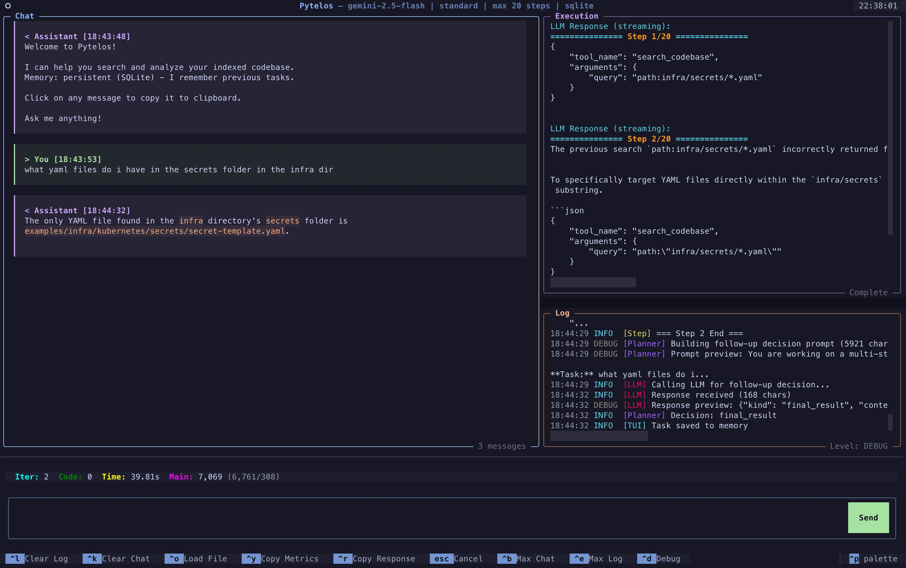

# Pytelos

A file indexer with semantic search and RAG (Retrieval-Augmented Generation) capabilities. Index your code and documents, search with natural language, and get intelligent answers through multi-step reasoning. I built PyTelos to explore the effectiveness of pgvector and textsearch extensions in RAG applications.

[](https://www.python.org/downloads/)
[](https://opensource.org/licenses/MIT)
[](https://github.com/astral-sh/ruff)
[](https://mypy-lang.org/)

## What It Does

Pytelos lets you:

- **Index codebases and documents** - Parse Python, PDF, Markdown, YAML, and Terraform files into searchable chunks with metadata extraction
- **Search semantically** - Find relevant code using natural language queries via vector similarity search
- **Search by keywords** - Use BM25 full-text search for exact matches
- **Combine both** - Hybrid search fuses vector and keyword results for best accuracy
- **Ask questions** - A reasoning agent reads your code, uses tools, and provides answers through multi-step analysis
- **Persist conversations** - Continue where you left off with SQLite-backed conversation memory

## Installation

### Prerequisites

- Python 3.11 or higher
- PostgreSQL 17+ with [pgvector](https://github.com/pgvector/pgvector) and [pg_textsearch](https://github.com/timescale/pg_textsearch) extensions
- API key for at least one LLM provider (OpenAI, DeepSeek, Anthropic, or Google Gemini)

### Install with uv

```bash
# Clone the repository
git clone https://github.com/richinex/pytelos.git
cd pytelos

# Install dependencies
uv sync
```

### Database Setup

Pytelos requires PostgreSQL with pgvector (vector search) and pg_textsearch (BM25) extensions.

```bash
# Using Docker Compose (recommended)
docker compose up -d

# Initialize the database schema
uv run pytelos init
```

This starts PostgreSQL 17 with both extensions pre-configured, plus pgAdmin for database management.

**Services:**
| Service | Port | Description |
|---------|------|-------------|
| PostgreSQL | 5433 | Database with pgvector + pg_textsearch |
| pgAdmin | 5051 | Database management UI |

## Configuration

Create a `.env` file in the project root:

```bash
# Database
POSTGRES_HOST=localhost
POSTGRES_PORT=5433
POSTGRES_DB=pytelos
POSTGRES_USER=pytelos
POSTGRES_PASSWORD=pytelos_dev

# LLM Provider (choose one: openai, deepseek, anthropic, gemini)
LLM_PROVIDER=gemini

# API Keys (provide keys for providers you want to use)
OPENAI_API_KEY=sk-proj-...      # Required for embeddings
DEEPSEEK_API_KEY=sk-...
ANTHROPIC_API_KEY=sk-ant-...
GEMINI_API_KEY=...

# Embedding (OpenAI embeddings used regardless of chat provider)
OPENAI_EMBEDDING_MODEL=text-embedding-3-small
```

See `.env.example` for all available configuration options.

## Usage

### CLI Commands

```bash
# Initialize database schema
uv run pytelos init

# Index a directory
uv run pytelos index ./your-codebase --pattern "**/*.py"

# Index with distributed processing (requires Pyergon)
uv run pytelos index ./your-codebase --distributed

# Search your indexed code
uv run pytelos search "how does authentication work"

# Search with specific mode
uv run pytelos search "parse config" --mode keyword
uv run pytelos search "error handling" --mode hybrid

# Interactive chat with your codebase
uv run pytelos chat

# Solve a specific task with reasoning
uv run pytelos solve "Explain how the search ranking works" --max-steps 10

# Solve with distributed execution
uv run pytelos solve "Find all API endpoints" --distributed

# Launch the terminal UI
uv run pytelos tui

# View indexing statistics
uv run pytelos stats

# Check service health
uv run pytelos health

# Clear all indexed data
uv run pytelos clear
```

### Terminal UI



The TUI provides an interactive interface with:

- Real-time streaming of LLM responses
- Execution metrics (iterations, tokens, processing time)
- Filterable execution logs (debug/info/warning/error)
- Keyboard shortcuts for common actions

```bash
uv run pytelos tui
```

**Key bindings:**
- `Ctrl+C` - Clear input / Exit
- `Ctrl+L` - Clear chat history
- `Ctrl+M` - Maximize output panel
- `Ctrl+Y` - Copy last response

## Supported File Types

| Format | Extensions | Parser |
|--------|------------|--------|
| Python | `.py`, `.pyi` | tree-sitter AST parsing with function/class extraction |
| PDF | `.pdf` | pypdf with page-by-page text extraction |
| Markdown | `.md` | markdown-it-py with frontmatter support |
| YAML | `.yaml`, `.yml` | Custom parser preserving structure |
| Terraform | `.tf`, `.hcl` | HCL2 parser for infrastructure code |

## Architecture

Pytelos follows [Parnas's information hiding principles](https://www.win.tue.nl/~wstomv/edu/2ip30/references/criteria_for_modularization.pdf): each module encapsulates specific design decisions behind clean abstractions.

```
src/pytelos/
├── storage/          # PostgreSQL backend
│                     # pgvector (HNSW/IVFFlat), pg_textsearch (BM25)
├── embedding/        # Embedding provider abstraction
│                     # Currently: OpenAI (text-embedding-3-small/large)
├── search/           # Hybrid search engine
│                     # Query expansion, re-ranking, RRF fusion
├── indexer/          # File parsing and chunking pipeline
│                     # Parsers: Python, PDF, Markdown, YAML, Terraform
├── llm/              # LLM provider abstraction
│                     # Providers: OpenAI, DeepSeek, Anthropic, Gemini
├── reasoning_agent/  # Multi-step ReAct agent
│                     # Tools: SearchCodebase, ReadFile, AnalyzeCode
├── agent/            # Document Q&A agent
├── memory/           # Conversation persistence
│                     # Backends: In-memory, SQLite
├── workflows/        # Indexing orchestration
│                     # Standard and distributed (via Pyergon)
├── ui/               # Textual-based TUI
├── cli/              # Typer CLI application
└── prompts/          # Externalized LLM prompts
```

### Search Modes

| Mode | Description |
|------|-------------|
| **Vector** | Cosine similarity search using 1536-dimensional embeddings |
| **Keyword** | BM25 full-text search via pg_textsearch |
| **Hybrid** | Reciprocal Rank Fusion (RRF) combining both approaches |

### Reasoning Agent

The reasoning agent uses a ReAct (Reason + Act) loop:

1. **Analyze** - Understand the task and current context
2. **Decide** - Choose the next action or provide final answer
3. **Execute** - Run the selected tool with parameters
4. **Observe** - Process tool output and update context
5. **Repeat** - Continue until task is complete or max steps reached

**Built-in Tools:**
- `SearchCodebaseTool` - Semantic and keyword search over indexed content
- `ReadFileTool` - Read file contents from the filesystem
- `AnalyzeCodeTool` - AST-based code structure analysis

### LLM Providers

| Provider | Models | Use Case |
|----------|--------|----------|
| OpenAI | gpt-4o, gpt-4o-mini | General purpose, tool calling |
| DeepSeek | deepseek-chat | Cost-effective reasoning |
| Anthropic | claude-3-5-sonnet | Complex analysis |
| Google | gemini-2.5-flash | Fast responses |

## Development

### Running Tests

```bash
# Run all tests with coverage
uv run pytest

# Run specific test file
uv run pytest tests/test_indexer.py

# Run only unit tests
uv run pytest -m unit

# Run with verbose output
uv run pytest -v
```

### Code Quality

```bash
# Format code
uv run ruff format .

# Lint code
uv run ruff check .

# Type checking
uv run mypy src/pytelos
```

### Project Structure

```
pytelos/
├── src/pytelos/      # Main package
├── tests/            # Test suite
├── docs/             # Documentation
│   └── ARCHITECTURE.md
├── pyproject.toml    # Project configuration
└── .env.example      # Environment template
```

## Dependencies

**Core:**
- pydantic - Data validation and settings
- numpy - Numerical operations
- asyncpg, psycopg - PostgreSQL async/sync drivers
- pgvector - Vector similarity search

**LLM/Embeddings:**
- openai - OpenAI API client
- anthropic - Anthropic API client
- google-genai - Google Gemini API client

**Parsing:**
- tree-sitter - AST parsing for Python
- pypdf - PDF text extraction
- markdown-it-py - Markdown parsing
- python-hcl2 - Terraform/HCL parsing

**Interface:**
- typer - CLI framework
- textual - TUI framework
- rich - Terminal formatting

**Orchestration:**
- pyergon - Durable workflow execution

## License

MIT License - see [LICENSE](LICENSE) for details.

## Author

Richard Chukwu ([@richinex](https://github.com/richinex))
